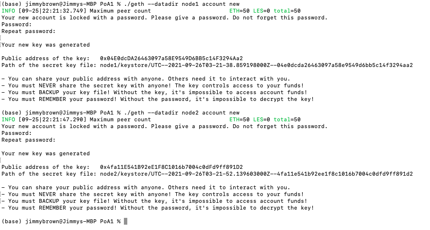
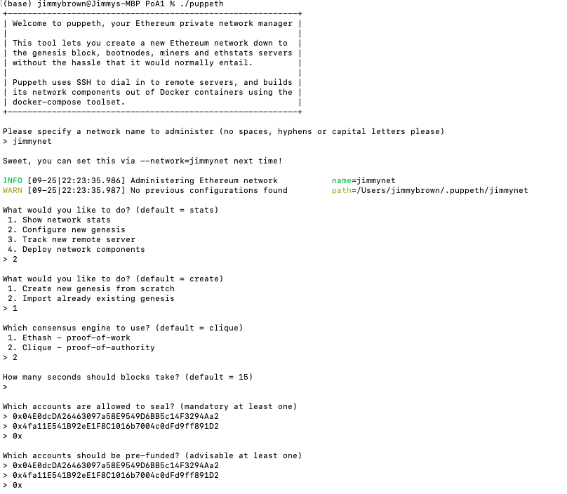
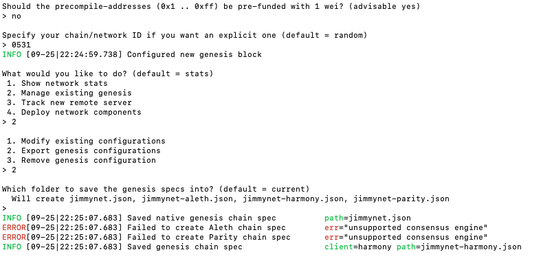
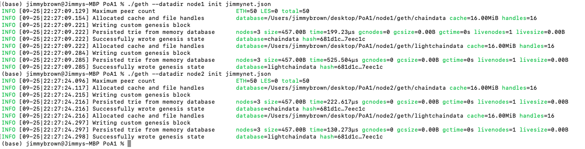
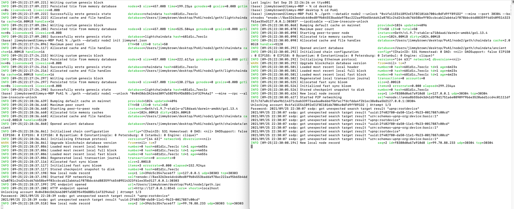
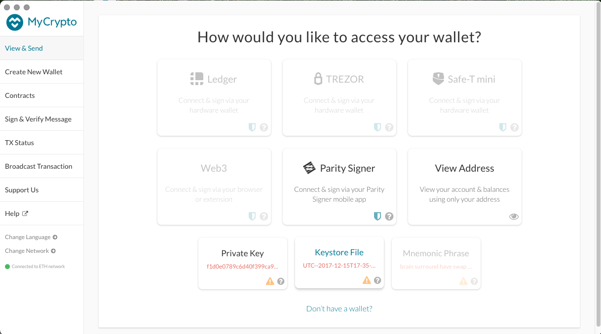
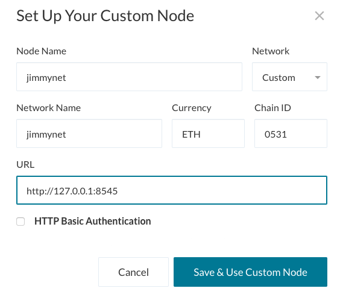
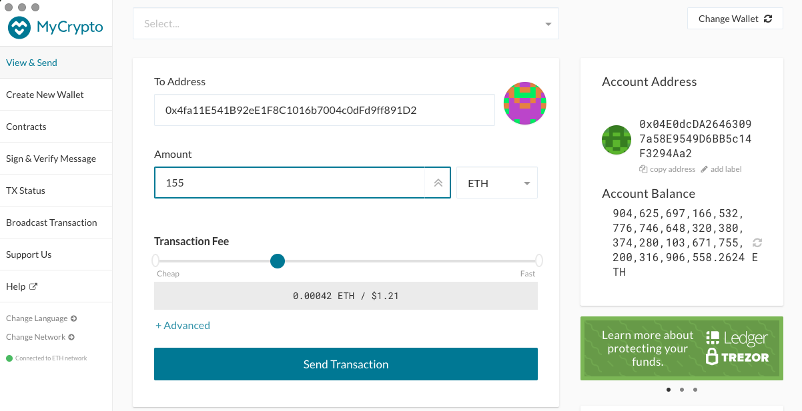
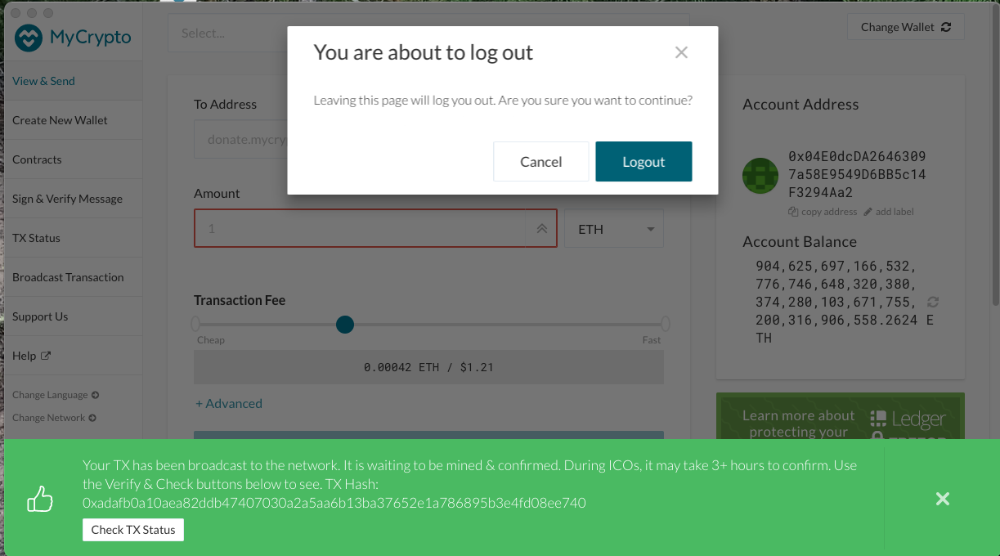

# Proof of Authority Development Chain

For this assignment, I assumed the role of a new developer at a small bank.

My mission is to set up a testnet blockchain for this organization.

To do this, I created and submitted four deliverables:

* Set up a custom testnet blockchain.

* Send a test transaction.

* Create a repository.

* Write instructions on how to use the chain for the rest of my team.

## Background

I have just landed a new job at ZBank, a small, innovative bank that is interested in exploring what
blockchain technology can do for them and their customers.

My first project at the company was to set up a private testnet that me and my team of developers
can use to explore potentials for blockchain at ZBank.

I decided on setting up a testnet because:

There is no real money involved, which will give my team of developers the freedom to experiment.

Testnets allows for offline development.

In order to set up a testnet, I needed to use the following skills/tools I learned in class:

* Puppeth, to generate my genesis block.

* Geth, a command-line tool, to create keys, initialize nodes, and connect the nodes together.

* The Clique Proof of Authority algorithm.

Tokens inherently have no value here, so I was provided pre-configured accounts and nodes for easy setup.

After creating the custom development chain, I created documentation for others on how to start it using the pre-configured
nodes and accounts. I named the network JB3Net. 

Be sure to include any preliminary setup information, such as installing dependencies and environment configuration.

## Instructions

### Setup the custom out-of-the-box blockchain

* Create accounts for two nodes for the network with a separate `datadir` for each using `geth`.
        * ./geth --datadir node1 account new
        * ./geth --datadir node2 account new

* Run `puppeth`, name your network, and select the option to configure a new genesis block.

* Choose the `Clique (Proof of Authority)` consensus algorithm.

* Paste both account addresses from the first step one at a time into the list of accounts to seal.

* Paste them again in the list of accounts to pre-fund. There are no block rewards in PoA, so you'll need to pre-fund.

* You can choose `no` for pre-funding the pre-compiled accounts (0x1 .. 0xff) with wei. This keeps the genesis cleaner.

* Complete the rest of the prompts, and when you are back at the main menu, choose the "Manage existing genesis" option.

* Export genesis configurations. This will fail to create two of the files, but you only need `jimmynet.json`.

* You can delete the `jimmynet-harmony.json` file.

* Initialize each node with the new `jimmynet.json` with `geth`.

* Run the first node, unlock the account, enable mining, and the RPC flag. Only one node needs RPC enabled.

* Set a different peer port for the second node and use the first node's `enode` address as the `bootnode` flag.

* Be sure to unlock the account and enable mining on the second node!

* You should now see both nodes producing new blocks, congratulations!

### Send a test transaction

* Use the MyCrypto GUI wallet to connect to the node with the exposed RPC port.

* You will need to use a custom network, and include the chain ID, and use ETH as the currency.

* Import the keystore file from the `node1/keystore` directory into MyCrypto. This will import the private key.

* Send a transaction from the `node1` account to the `node2` account.

* Copy the transaction hash and paste it into the "TX Status" section of the app, or click "TX Status" in the popup.

* Screenshot the transaction metadata (status, tx hash, block number, etc) and save it to your Screenshots folder.

* Celebrate, you just created a blockchain and sent a transaction!

### Create a repository, and instructions for launching the chain

* Create a `README.md` in your project directory and create documentation that explains how to start the network.

* Remember to include any environment setup instructions and dependencies.

* Be sure to include all of the `geth` flags required to get both nodes to mine and explain what they mean.

* Explain the configuration of the network, such as it's blocktime, chain ID, account passwords, ports, etc.

* Explain how to connect MyCrypto to your network and demonstrate (via screenshots and steps) and send a transaction.

* Upload the code, including the `networkname.json` and node folders.

### Remember, *never* share your mainnet private keys! This is a testnet, so coins have no value here!

### Hints

* If you get stuck - try our step by step PoA Guide located [here](Resources/POA-Blockchain-guide.md).

* If you aren't seeing any movement in the wallet amounts in MyCrypto after sending/receiving transactions, try the following:
    * Terminate both nodes using `control+C` in the Node1 and Node2 terminal windows.
    * Change networks in MyCrypto to a Testnet such as Kovan.
    * Restart Node1 and Node2 in their terminal windows.
    * Reconnect to your network in MyCrypto.
    * Log into your wallet and refresh the amount.
    
* If that doesn't help make sure you are sending a large enough sum of ETH to see actual movement in the digits. You may have to click on the amount itself to see the full value down to the WEI.

    

---
